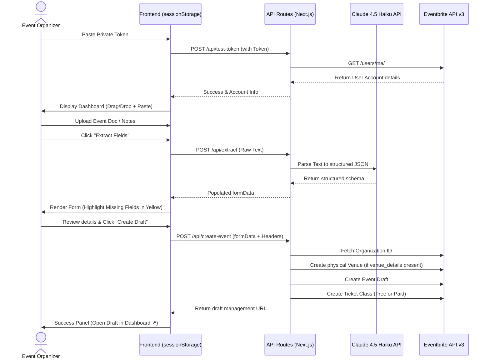

# Eventbrite Integration Engine — Architecture & Technical Specifications

This document outlines the core architecture, security design, data models, and API transaction flows of the Eventbrite Integration Engine. It serves as a comprehensive onboarding guide for future developers and LLMs working on this codebase.

---

## 1. System Overview & Core Principles

The Eventbrite Integration Engine is a lightweight, secure Next.js (App Router, TypeScript) application that automates the transition from raw, unstructured textual documents (emails, meeting notes, messaging threads) to ready-to-publish Eventbrite draft events.

### Design Principles:
1. **Security-First (Transient Authentication)**: To protect organizer accounts, **Eventbrite private tokens are never saved, stored, or logged on any server-side database**. 
   * The token is captured via a connection panel, kept strictly client-side in `sessionStorage`, and sent with each transaction in the request's `Authorization: Bearer <token>` header.
2. **Deterministic over Conversational**: The AI's job is strictly to map unstructured text to a clean schema. All final adjustments, date picking, and overrides are done by the user in a native, custom-styled form before hitting the Eventbrite API.
3. **No Database Overhead**: The entire application is stateful in the browser session, utilizing Next.js API routes as secure proxy layers.

---

## 2. Technical Stack & Layout System

* **Core**: Next.js 14+ (App Router), TypeScript, React.
* **Styling**: Pure custom Vanilla CSS (`src/app/globals.css`). No TailwindCSS.
* **Aesthetics**: Glassmorphism design system utilizing translucent panels (`backdrop-filter`), variable harmonious custom colors, HSL typography scales (`Inter`/`Outfit` Google Fonts), smooth transitions, custom loading animations, and clear field-warning badges.
* **LLM Engine**: Anthropic Claude SDK, using **`claude-haiku-4-5-20251001`** for fast, high-accuracy structured JSON extraction.

---

## 3. Core Component Workflow



---

## 4. Endpoint Specifications

### A. Token Verification: `POST /api/test-token`
* **Purpose**: Proxies authentication to bypass CORS and verify the user's private token before granting access.
* **Payload**: `{"token": "ORGANIZER_PRIVATE_TOKEN"}`
* **Upstream Request**: `GET https://www.eventbriteapi.com/v3/users/me/`
* **Response**: Account owner name and primary verified email.

### B. LLM Extraction: `POST /api/extract`
* **Purpose**: Feeds raw text into Claude to extract key details.
* **Model**: `claude-haiku-4-5-20251001`
* **Payload**: `{"text": "RAW_UNSTRUCTURED_EVENT_DETAILS"}`
* **Extracted Schema**:
  ```typescript
  interface ExtractedEventData {
    name: string | null;           // Event Title
    description: string | null;    // Rich HTML/Text Event description
    start_utc: string | null;      // ISO 8601 UTC date-time string
    start_timezone: string;        // IANA Timezone ID (Default: "America/Edmonton")
    end_utc: string | null;        // ISO 8601 UTC date-time string
    end_timezone: string;          // IANA Timezone ID (Default: "America/Edmonton")
    currency: string;              // ISO 4217 Currency Code (Default: "CAD")
    is_online: boolean | null;     // Virtual vs Physical status
    venue_details: string | null;  // Raw address / location text
    ticket_type: string | null;    // "free" | "paid"
    ticket_price: number | null;   // Ticket pricing value (Default: 0)
  }
  ```
* **Extraction Rules**:
  * Return `null` for any missing field (no guessing dates).
  * Convert conversational timelines (e.g., *"Saturday, June 20th at 12:30 PM"* in Calgary) into strict UTC datetimes (`2026-06-20T18:30:00Z`).

### C. Eventbrite Transaction: `POST /api/create-event`
* **Purpose**: Connects to the Eventbrite API v3 in a strict transaction order.
* **Auth**: `Authorization: Bearer <Private Token>` in request headers.
* **Pipeline Sequence**:
  1. **Fetch Org ID**: Hits `GET /v3/users/me/organizations/` and selects the first organization ID (`organizationId`).
  2. **Create Venue (Conditional)**: If `is_online` is `false` and `venue_details` is provided:
     * Hits `POST /v3/organizations/{organizationId}/venues/`.
     * Passes `venue_details` under `address_1` and returns a `venueId`.
  3. **Create Draft Event**:
     * Hits `POST /v3/organizations/{organizationId}/events/`.
     * Passes standard Eventbrite Event structure (including `venue_id` if created).
     * Returns the created draft `eventId`.
  4. **Create Ticket Class**:
     * Hits `POST /v3/events/{eventId}/ticket_classes/`.
     * Sets class status as `"General Admission"`.
     * If paid, passes `cost` as a formatted string: `"{currency},{amountInCents}"` (e.g. `CAD,1000` for a $10.00 ticket).
  5. **Compile Response**: Returns a direct dashboard management details page:
     `https://www.eventbrite.com/manage/events/{eventId}/details`

---

## 5. Architectural Gotchas & Troubleshooting

### 1. `EVENT_TAX_SETTINGS_MISSING` (Important)
If an organizer's account is based in a strict tax jurisdiction (such as **Canada** or Germany) and they have not configured their organizer profile tax settings, Eventbrite will throw an `EVENT_TAX_SETTINGS_MISSING` error during event or ticket creation.
* **Resolution**: This is a legally-mandated account-level blocker. The user must manually log in to their Eventbrite dashboard once, navigate to **Account Settings** $\rightarrow$ **Payments & Tax** $\rightarrow$ **Taxpayer Info** (or click into any event dashboard and navigate to **Tax**), complete the legal tax questionnaire/GST registration details, and save. Future API requests will succeed instantly.

### 2. Timezone Pickers & HTML Inputs
* In Next.js, HTML `<input type="datetime-local" />` elements expect values formatted as `YYYY-MM-DDTHH:MM` in local browser time.
* The frontend contains utility calculations that offset the LLM-extracted UTC ISO timestamps back into local string formats to ensure compatibility with calendar input controls, converting them back to UTC strings during submission.
